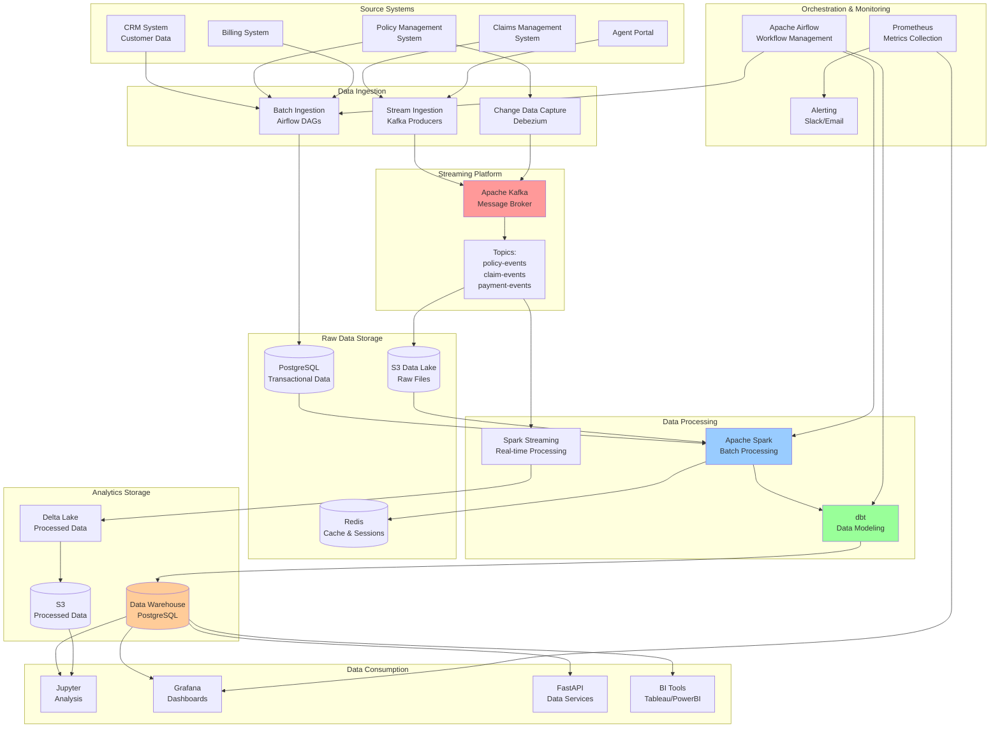

# Data Flow Architecture

This document describes the end-to-end data flow in the Insurance Data Platform, from source systems to analytics consumption.

## 🌊 High-Level Data Flow



## 📥 Data Ingestion Patterns

### 1. Batch Ingestion (Daily ETL)

**Pattern**: Full and incremental loads via Airflow

```python
# Example Airflow DAG structure
insurance_etl_dag = DAG(
    dag_id='insurance_data_pipeline',
    schedule_interval='@daily',
    tasks=[
        'extract_policy_data',      # Pull from Policy Management System
        'extract_customer_data',    # Pull from CRM
        'extract_claims_data',      # Pull from Claims System  
        'data_quality_check',       # Validate data quality
        'spark_transformation',     # Process with Spark
        'dbt_modeling',            # Build dimensional models
        'publish_to_kafka'         # Stream processed events
    ]
)
```

**Data Sources**:
- **CRM**: Customer demographics, contact info, risk profiles
- **Policy System**: Policy details, coverages, premiums
- **Billing**: Payment transactions, billing cycles
- **Agent Portal**: Agent activities, commissions

### 2. Streaming Ingestion (Real-time)

**Pattern**: Event-driven data capture via Kafka

```json
// Example policy event
{
  "event_type": "policy_created",
  "timestamp": "2024-01-15T10:30:00Z",
  "policy_id": "POL123456",
  "customer_id": "CUST789",
  "policy_type": "auto",
  "premium_amount": 1200.00,
  "effective_date": "2024-02-01",
  "agent_id": "AGT456"
}
```

**Event Sources**:
- **Claims System**: New claims, status updates, settlements
- **Agent Portal**: Quote requests, policy sales
- **Customer Portal**: Self-service actions
- **Payment System**: Payment confirmations, failures

### 3. Change Data Capture (CDC)

**Pattern**: Database change streams via Debezium

```yaml
# Debezium PostgreSQL connector
connector:
  name: "policy-postgres-connector"
  config:
    connector.class: "io.debezium.connector.postgresql.PostgresConnector"
    database.hostname: "policy-db"
    database.dbname: "policies"
    table.include.list: "public.policies,public.customers"
    publication.name: "insurance_publication"
```

## 🔄 Data Processing Pipeline

### Stage 1: Raw Data Landing

```sql
-- Raw data stored with minimal transformation
CREATE TABLE raw_data.policies (
    policy_id UUID,
    customer_id UUID, 
    policy_number VARCHAR(50),
    premium_amount DECIMAL(12,2),
    created_at TIMESTAMP,
    updated_at TIMESTAMP,
    source_system VARCHAR(50),
    batch_id VARCHAR(100)
);
```

### Stage 2: Data Quality & Cleansing

```python
# Spark data quality framework
def validate_policy_data(df):
    quality_checks = [
        check_null_values(['policy_id', 'customer_id']),
        check_positive_values(['premium_amount']),
        check_date_ranges(['effective_date', 'expiration_date']),
        check_referential_integrity('customer_id', 'customers'),
        check_business_rules('premium_tier_consistency')
    ]
    return apply_quality_checks(df, quality_checks)
```

### Stage 3: Spark Transformations

```python
# Example Spark transformation
def enrich_policy_data(spark):
    policies = spark.table("raw_data.policies")
    customers = spark.table("raw_data.customers")
    
    enriched = policies.join(customers, "customer_id") \
        .withColumn("policy_age_days", 
                   datediff(current_date(), col("effective_date"))) \
        .withColumn("premium_tier",
                   when(col("premium_amount") <= 1000, "Basic")
                   .when(col("premium_amount") <= 3000, "Standard")
                   .otherwise("Premium")) \
        .withColumn("customer_lifetime_value",
                   col("total_premium") * col("retention_probability"))
    
    return enriched
```

### Stage 4: dbt Modeling

```sql
-- dbt model: marts/dim_customers.sql
WITH customer_metrics AS (
  SELECT 
    customer_id,
    COUNT(DISTINCT policy_id) as total_policies,
    SUM(premium_amount) as lifetime_premium,
    AVG(risk_score) as avg_risk_score,
    MIN(effective_date) as first_policy_date
  FROM {{ ref('stg_policies') }}
  GROUP BY customer_id
),

customer_classification AS (
  SELECT *,
    CASE 
      WHEN lifetime_premium >= 5000 THEN 'High Value'
      WHEN lifetime_premium >= 2000 THEN 'Medium Value' 
      ELSE 'Standard'
    END as customer_segment
  FROM customer_metrics
)

SELECT * FROM customer_classification
```

## 📊 Data Storage Strategy

### 1. Raw Data Layer
- **Purpose**: Exact copy of source system data
- **Storage**: PostgreSQL + S3 (JSON/Parquet)
- **Retention**: 7 years for compliance
- **Schema**: Source system schema preserved

### 2. Staging Layer  
- **Purpose**: Cleaned, validated, standardized data
- **Storage**: PostgreSQL (structured) + Delta Lake (files)
- **Retention**: 2 years
- **Schema**: Normalized, with data quality flags

### 3. Marts Layer
- **Purpose**: Business-ready dimensional models
- **Storage**: PostgreSQL (OLAP optimized)
- **Retention**: 5 years + archives
- **Schema**: Star schema with dimensions and facts

### 4. Real-time Layer
- **Purpose**: Low-latency data access
- **Storage**: Redis (key-value) + Kafka (streaming)
- **Retention**: 30 days (Redis), 7 days (Kafka)
- **Schema**: Denormalized for fast access

## 🚀 Stream Processing Architecture

### Kafka Topics Structure

```yaml
Topics:
  policy-events:
    partitions: 6
    replication: 3
    retention: 7 days
    consumers: [spark-streaming, analytics-service]
    
  claim-events:
    partitions: 6  
    replication: 3
    retention: 7 days
    consumers: [fraud-detection, settlements]
    
  payment-events:
    partitions: 3
    replication: 3
    retention: 30 days
    consumers: [accounting, collections]
```

### Stream Processing Jobs

```python
# Spark Structured Streaming
def process_policy_events():
    policy_stream = spark \
        .readStream \
        .format("kafka") \
        .option("kafka.bootstrap.servers", "kafka:9092") \
        .option("subscribe", "policy-events") \
        .load()
    
    processed_stream = policy_stream \
        .select(from_json(col("value"), policy_schema).alias("data")) \
        .select("data.*") \
        .withColumn("processing_time", current_timestamp()) \
        .withWatermark("timestamp", "10 minutes") \
        .groupBy(window(col("timestamp"), "5 minutes"), col("policy_type")) \
        .agg(
            count("policy_id").alias("policy_count"),
            sum("premium_amount").alias("total_premium"),
            avg("premium_amount").alias("avg_premium")
        )
    
    return processed_stream.writeStream \
        .format("delta") \
        .option("checkpointLocation", "/checkpoints/policy-aggregates") \
        .outputMode("append") \
        .start("/delta/policy-aggregates")
```

## 🔍 Data Quality Framework

### Quality Dimensions Monitored

1. **Completeness**: No missing required fields
2. **Validity**: Data conforms to business rules  
3. **Accuracy**: Data matches source of truth
4. **Consistency**: Data is consistent across systems
5. **Timeliness**: Data is available when needed
6. **Uniqueness**: No duplicate records

### Quality Metrics Tracking

```sql
-- Daily data quality dashboard
SELECT 
  table_name,
  check_date,
  total_records,
  failed_records,
  (failed_records::float / total_records * 100) as failure_rate,
  CASE 
    WHEN failure_rate < 1 THEN 'GOOD'
    WHEN failure_rate < 5 THEN 'WARNING'  
    ELSE 'CRITICAL'
  END as quality_status
FROM monitoring.data_quality_results
WHERE check_date >= CURRENT_DATE - 7
ORDER BY check_date DESC, failure_rate DESC;
```

## 📈 Performance Optimization

### 1. Data Partitioning Strategy

```sql
-- Partition tables by date for performance
CREATE TABLE raw_data.policies (
  policy_id UUID,
  created_date DATE,
  -- other columns
) PARTITION BY RANGE (created_date);

-- Create monthly partitions
CREATE TABLE raw_data.policies_2024_01 
PARTITION OF raw_data.policies 
FOR VALUES FROM ('2024-01-01') TO ('2024-02-01');
```

### 2. Indexing Strategy

```sql
-- Performance indexes on high-query columns
CREATE INDEX idx_policies_customer_id ON raw_data.policies(customer_id);
CREATE INDEX idx_policies_type_status ON raw_data.policies(policy_type, policy_status);
CREATE INDEX idx_claims_policy_date ON raw_data.claims(policy_id, incident_date);
```

### 3. Caching Strategy

```python
# Redis caching for frequently accessed data
@cache_result(ttl=3600)  # Cache for 1 hour
def get_customer_policies(customer_id):
    return query_database(
        "SELECT * FROM marts.dim_customers WHERE customer_id = %s",
        [customer_id]
    )
```

## 🔐 Data Security & Compliance

### 1. Encryption
- **At Rest**: All databases encrypted with AES-256
- **In Transit**: TLS 1.2+ for all data movement
- **Application**: Field-level encryption for PII

### 2. Access Controls
- **Role-Based**: Separate roles for analysts, engineers, admins
- **Column-Level**: Sensitive data masked for non-privileged users
- **Time-Based**: Automatic credential rotation

### 3. Audit Logging
```sql
-- All data access logged for compliance
CREATE TABLE audit.data_access_log (
  access_id UUID PRIMARY KEY,
  user_id VARCHAR(100),
  table_accessed VARCHAR(100), 
  access_type VARCHAR(20), -- SELECT, INSERT, UPDATE, DELETE
  row_count INTEGER,
  access_timestamp TIMESTAMP,
  client_ip INET,
  query_hash VARCHAR(64)
);
```

This data flow architecture provides a robust, scalable foundation for insurance data processing, ensuring high data quality, real-time capabilities, and enterprise-grade security and compliance.